## Part I

- Взять официальный докер образ с nginx и выкачать его при помощи docker pull
- Проверить наличие докер образа через docker images

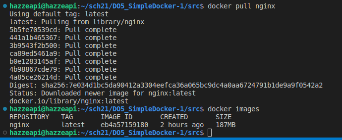
 
<i>команда docker pull nginx</i>
<i>команда docker docker images</i>

- Запустить докер образ через docker run -d [image_id|repository]
- Проверить, что образ запустился через docker ps

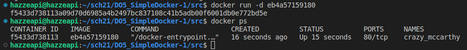
 
<i>команда docker run -d и docker ps</i>

- Посмотреть информацию о контейнере через docker inspect [container_id|container_name]

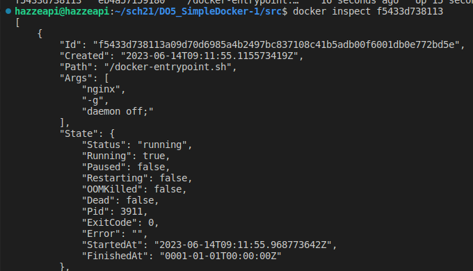
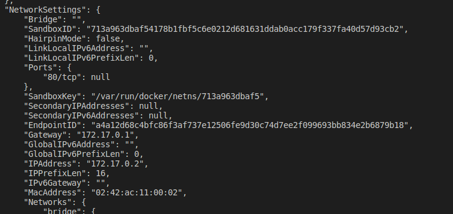
 
<i>команда docker inspect[container_id|container_name]</i>

- По выводу команды определить и поместить в отчёт размер контейнера, список замапленных портов и ip контейнера
- Остановить докер образ через docker stop [container_id|container_name]
- Проверить, что образ остановился через docker ps

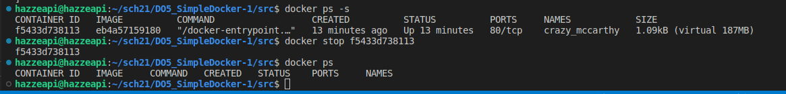
 
<i>команда docker ps -s</i>
<i>команда docker stop  [container_id|container_name] и docker ps</i>

- Запустить докер с портами 80 и 443 в контейнере, замапленными на такие же порты на локальной машине, через команду run
do

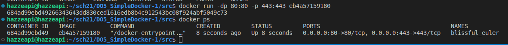
 
<i>команда docker run -dp 80:80 -p 443:443  id и docker ps</i>

- Проверить, что в браузере по адресу localhost:80 доступна стартовая страница nginx

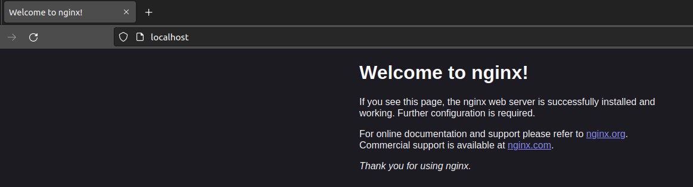
 
<i>вывод localhost:80 в браузере</i>

- Перезапустить докер контейнер через docker restart [container_id|container_name]

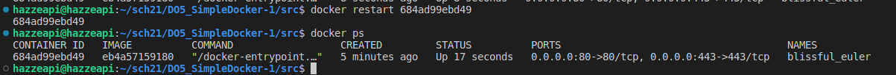
 
<i>команда docker restart id и docker ps</i>

- Проверить любым способом, что контейнер запустился

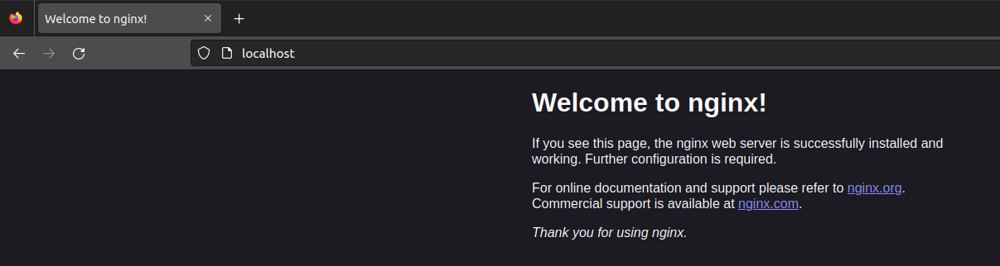
 
<i>повторынй вывод localhost:80 в браузере для проверки запуска контейнера</i>

## Part II

- Прочитать конфигурационный файл nginx.conf внутри докер контейнера через команду exec

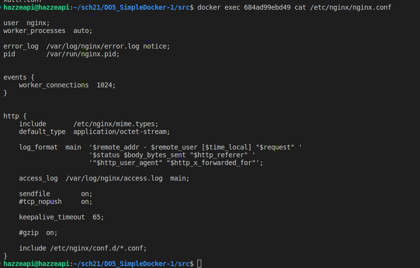
 
<i>команда docker exec id cat /etc/nginx/nginx.conf</i>

- Создать на локальной машине файл nginx.conf
- Настроить в нем по пути /status отдачу страницы статуса сервера nginx

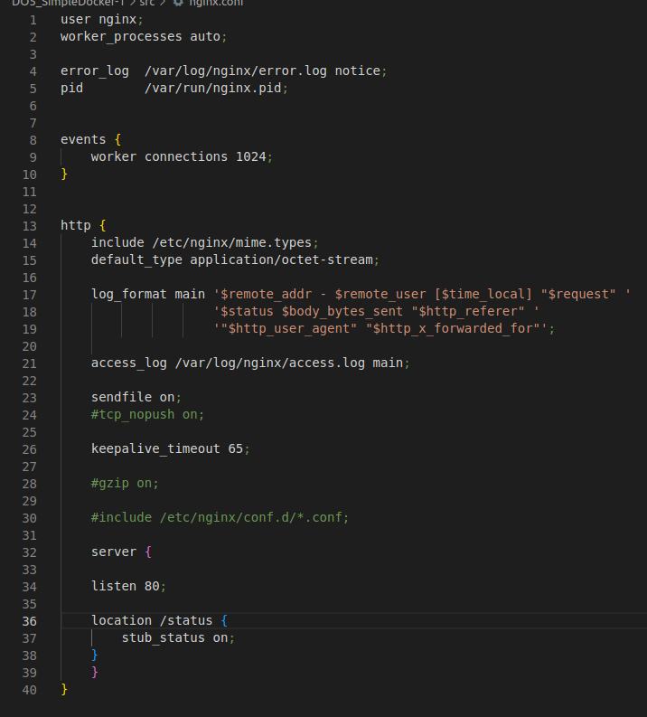
 
<i>файл nginx.conf</i>

- Скопировать созданный файл nginx.conf внутрь докер образа через команду docker cp
- Перезапустить nginx внутри докер образа через команду exec

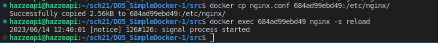
 
<i>команда docker cp nginx.conf id:/etc/nginx/ и docker exec id nginx -s reload</i>

- Проверить, что по адресу localhost:80/status отдается страничка со статусом сервера nginx

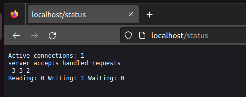
 
<i>вывод localhost:status в браузере</i>

- Экспортировать контейнер в файл container.tar через команду export
- Остановить контейнер

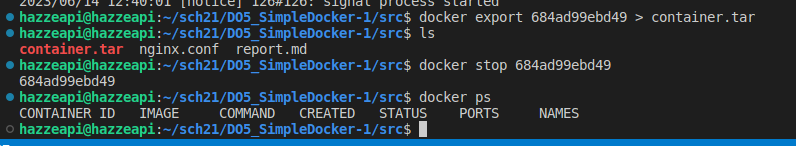
 
<i>команда docker export id > container.tar</i>
<i>команда docker stop id</i>

- Удалить образ через docker rmi [image_id|repository], не удаляя перед этим контейнеры

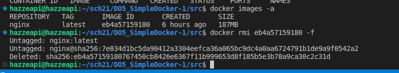
 
<i>команда docker images -a и docker rmi  id -f</i>

- Удалить остановленный контейнер

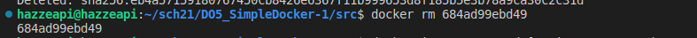
 
<i>команда docker rm id</i>

- Импортировать контейнер обратно через команду import
- Запустить импортированный контейнер

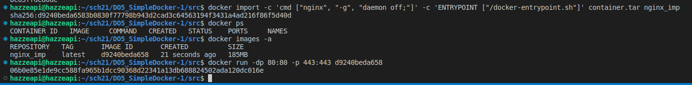
 
<i>команда docker import -c 'cmd ["nginx", "-g", "daemon off;"]' -c 'ENTRYPOINT ["/docker-entrypoint.sh"]' container.tar nginx_imp </i>
<i>запуск контейнера командой docker run -dp 80:80 -p 443:443 id</i>

- Проверить, что по адресу localhost:80/status отдается страничка со статусом сервера nginx 

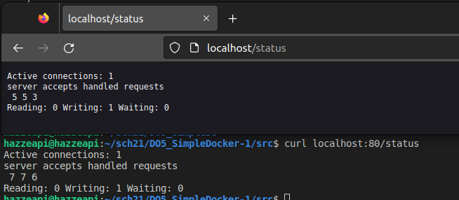
 
<i>вывод localhost:status в браузере и через терминал</i>

## PART 3

- Написать мини сервер на C и FastCgi, который будет возвращать простейшую страничку с надписью Hello World!
- Написать свой nginx.conf , который будет проксировать все запросы с 81 порта на 127.0.0.1:8080

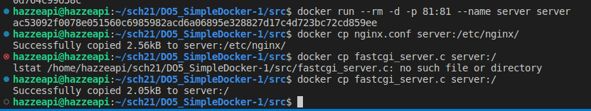
 
<i>мини сервер на C и FastCgi</i>

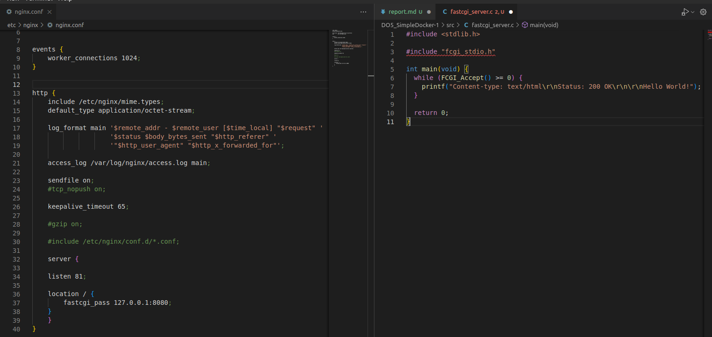
 

- Запустить написанный мини сервер через spawn-fcgi на порту 8080

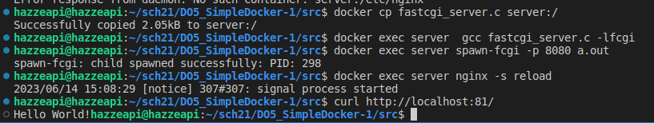
 

- Проверить, что в браузере по localhost:81 отдается написанная вами страничка

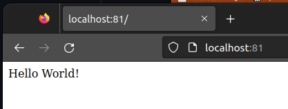
 
<i>вывод localhost:81 в браузере</i>

## PART 4

- Написать свой докер образ

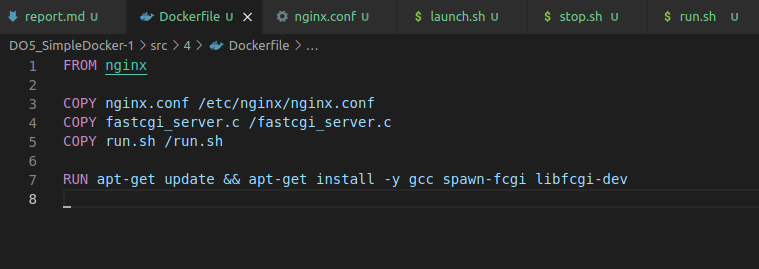
 

- Собрать написанный докер образ через docker build при этом указав имя и тег

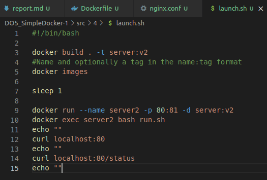
 

- Проверить через docker images, что все собралось корректно

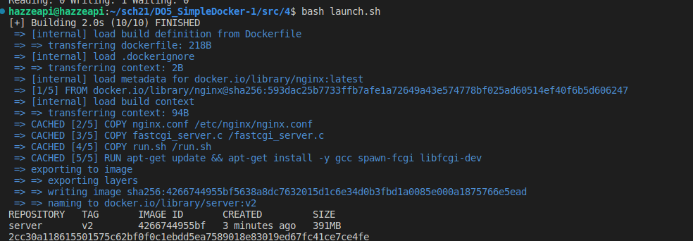
 

- Проверить, что по localhost:80 доступна страничка написанного мини сервера
- Проверить, что теперь по localhost:80/status отдается страничка со статусом nginx

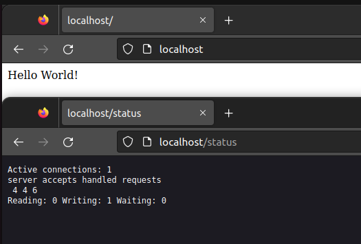
 

## PART 5

- установить dockle запустив скрипт setD.sh

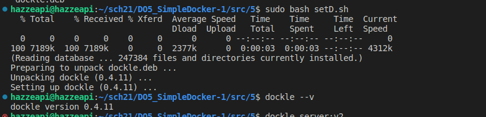
 

- Просканировать образ из предыдущего задания через dockle [image_id|repository]

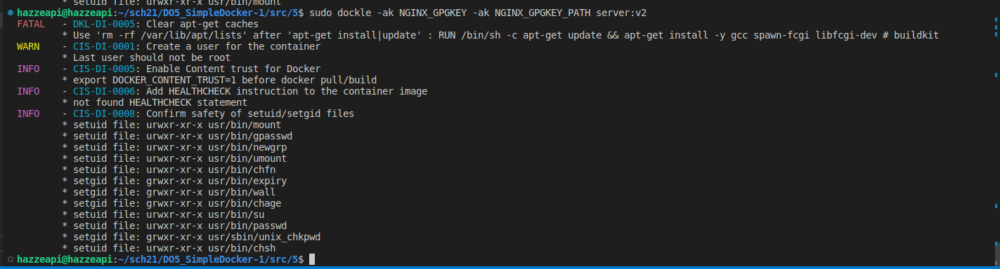
 
<i>команда dockle [image_id|repository]</i>

- Исправить образ так, чтобы при проверке через dockle не было ошибок и предупреждений

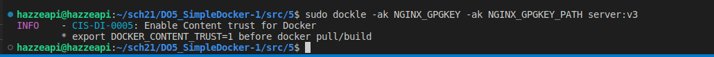
 
<i>команда dockle [image_id|repository] без ошибок и предупреждений</i>

## PART 6

- Написать файл docker-compose.yml

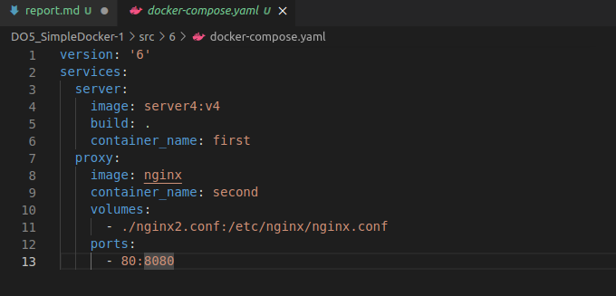
 
<i>docker-compose.yml</i>

- Проверить, что в браузере по localhost:80 отдается написанная вами страничка, как и ранее

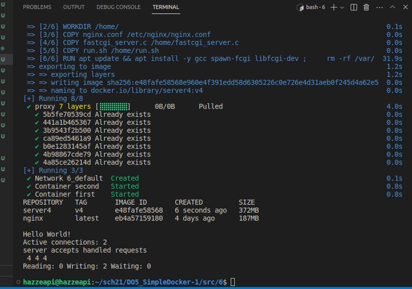
 
<i>curl localhost:80</i>

- Остановить все запущенные контейнеры

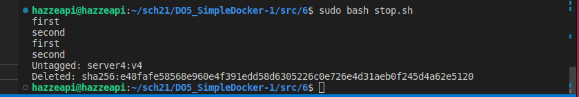
 
